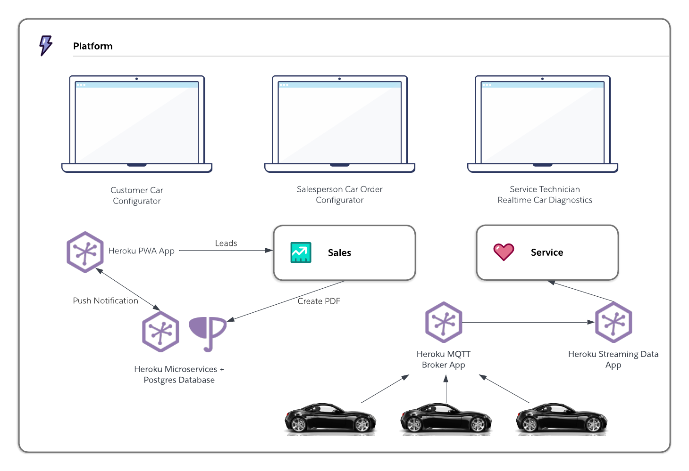

# eCars

[](https://github.com/trailheadapps/ecars/actions?query=workflow%3ACI) [](https://codecov.io/gh/trailheadapps/ecars) [](https://lerna.js.org/)


Sample car sales and service application. Pulsar is a fictitious electric car manufacturer company. This application helps Pulsar to sell cars on-site, and through their customer-facing website. Event-driven patterns allow to build loosely coupled integrations using multiple programming languages and systems. Regardless of the industry you work in, this app demonstrates how to build rich and immersive user experiences with the connected compute and runtime capabilities of the Salesforce Platform.



## Table of Contents

-   [eCars](#ecars)
    -   [Table of Contents](#table-of-contents)
    -   [Installation](#installation)
        -   [Prerequisites](#prerequisites)
        -   [Automated Deploy](#automated-deploy)
        -   [Manual Deploy](#manual-deploy)
        -   [Teardown](#teardown)
    -   [Demo Highlights](#demo-highlights)
    -   [Additional Resources](#additional-resources)
        -   [Archive IoT Car Diagnostic Data with Postgres](#archive-iot-car-diagnostic-data-with-postgres)
    -   [Development](#development)

## Installation

### Prerequisites

You will need the following to deploy this sample app.

-   `git` (download [here](https://git-scm.com/downloads))
-   `node` >= v12 and < v19 (download [here](https://nodejs.org/en/download/))
-   Salesforce Dev Hub
    -   If you don't have one, [sign up](https://developer.salesforce.com/signup) for a Developer Edition org and then follow the [instructions](https://help.salesforce.com/articleView?id=sfdx_setup_enable_devhub.htm&type=5) to enable Dev Hub.
-   `sfdx` CLI >= 7.11.0 (download [here](https://developer.salesforce.com/tools/sfdxcli))
-   Heroku account ([signup](https://signup.heroku.com))
-   `heroku` CLI (download [here](https://devcenter.heroku.com/articles/heroku-cli))

**Disclaimer:** You'll need to have a paid [Heroku Account](https://signup.heroku.com/) and be subscribed to the Heroku Eco and Heroku Postgres Mini plans, for more information visit the [Heroku Pricing](https://www.heroku.com/pricing) page.

### Automated Deploy

This project consists of multiple "apps" consolidated into one monorepo so that they are easier to deploy. The simplest way to configure and deploy all the apps is to run the following commands. The [`scripts/ecarsDeploy.js`](./scripts/ecarsDeploy.js) file is what automates all the deploys and integrates them with various configuration values.

The `ecarsDeploy.js` script will create and deploy code to a Salesforce scratch org and then deploy four Heroku apps along with some Postgres databases.

```console
$ sfdx auth:web:login -d -a DevHub  # Authenticate using your Dev Hub org credentials
$ heroku login  # Login with your Heroku account (or create one)
$ git clone https://github.com/trailheadapps/ecars.git
$ cd ecars/scripts
$ npm install
$ cd ..
$ node scripts/ecarsDeploy.js
```

If instead you want to perform all the deploy and configuration steps manually, see the [Manual Deploy](#manual-deploy) section below.

When the deploy is finished follow the last few instructions provided by the script, and then go to [Demo Highlights](#demo-highlights) below.

If you'd like to perform all the steps in the deploy script manually, you can follow the instructions below.

### Manual Deploy

The below steps do everything the [Automated Deploy](#automated-deploy) does. It's recommended that you use the Automated Deploy to make the deploy easier for you and reduce the chance of error. If at any time, you are having a problem with the below steps and would like to start over, follow the steps in the [Teardown](#teardown) section below.

1. Authenticate with the `sfdx` and `heroku` CLI commands and get the eCars code onto your computer.

    ```console
    $ sfdx auth:web:login -d -a DevHub  # Authenticate using your Dev Hub org credentials
    $ heroku login  # Login with your Heroku account (or create one)
    $ git clone https://github.com/trailheadapps/ecars.git
    ```

1. Create a scratch org

    ```console
    $ sfdx force:org:create --setdefaultusername --definitionfile=config/project-scratch-def.json --setalias=ecars --targetdevhubusername=DevHub
    ```

1. Generate a password for the scratch org user. Save both the username and password for later.

    ```console
    $ sfdx force:user:password:generate -u ecars
    ```

1. Generate a Security Token for the scratch org user. Run the following command and then click Reset Security Token. You will receive the security token in an email. This will be used later for the `SF_TOKEN` config var in the Heroku apps.

    ```console
    $ sfdx force:org:open -u ecars -p /lightning/settings/personal/ResetApiToken/home
    ```

1. (Optional) Activate the `Pulsar_Bold` theme on the `Themes and Branding` page by running the following command:

    ```console
    $ sfdx force:org:open -u ecars -p /lightning/setup/ThemingAndBranding/home
    ```

1. Deploy and configure the **Heroku MQTT application**

    1. Click the Heroku Deploy Button to deploy the application to Heroku. Provide a unique application name to be used as [MQTT APP NAME] below. Leave all other inputs as the defaults.

        [](https://heroku.com/deploy?template=https://github.com/trailheadapps/ecars/tree/main&env[APP_BASE]=apps/ecars-mqtt-broker)

1. Deploy and configure the **Heroku Streaming application**

    1. Click the Heroku Deploy Button to deploy the streaming data application to Heroku. Provide a unique application name to be used as [STREAMING APP NAME] below. Leave all other inputs as the defaults.

        [](https://heroku.com/deploy?template=https://github.com/trailheadapps/ecars/tree/main&env[APP_BASE]=apps/ecars-realtime)

    1. Create a Heroku Postgres database and attach it to the application

        ```console
        $ heroku addons:create heroku-postgresql:mini --app=[STREAMING APP NAME] --wait
        ```

    1. Provision the Heroku Postgres database

        ```console
        $ heroku run 'cd packages/ecars-db && npx sequelize db:migrate' --app=[STREAMING APP NAME]
        ```

    1. Scale the application's dynos

        ```console
        $ heroku ps:scale web=1:eco sensor-simulator=1:eco sensor-persistence=0:eco --app=[STREAMING APP NAME]
        ```

    1. Link with the **Heroku MQTT app**

        ```console
        $ heroku config:set MQTT_BROKER_URL=[MQTT APP URL] --app=[STREAMING APP NAME]
        ```

        _Note: Make sure this URL has the Secure WebSockets Protocol `wss://` instead of `https://`. eg: `wss://example.herokuapp.com`_

1. Deploy and configure the **Heroku Progressive Web Application** (PWA)

    1. Click the Heroku Deploy Button to deploy the progressive web application to Heroku. Provide a unique application name to be used as [PWA NAME] below. Leave all other inputs as the defaults.

        [](https://heroku.com/deploy?template=https://github.com/trailheadapps/ecars/tree/main&env[APP_BASE]=apps/ecars-pwa)

    1. Create a Heroku Postgres database and attach it to the application

        ```console
        $ heroku addons:create heroku-postgresql:mini --app=[PWA APP NAME] --wait
        ```

    1. Initialize database tables

        ```console
        $ heroku run node scripts/createPostgresTable.js --app=[PWA APP NAME]
        ```

    1. Generate VAPID public and private keys for web push notifications. Save them for the next command and also the next Heroku application deploy.

        ```console
        $ npx web-push generate-vapid-keys
        ```

    1. Set config vars

        ```console
        $ heroku config:set VAPID_PUBLIC_KEY=[VAPID PUBLIC KEY] VAPID_PRIVATE_KEY=[VAPID PRIVATE KEY] SF_USERNAME=[ORG USERNAME] SF_PASSWORD=[ORG USER'S PASSWORD] SF_LOGIN_URL=[ORG LOGIN URL] SF_TOKEN=[ORG USER'S TOKEN] --app=[PWA NAME]
        ```

1. Deploy and configure the **Heroku Microservices Application**

    1. Click the Heroku Deploy Button to deploy the microservices application to Heroku. Provide a unique application name to be used as [MICROSERVICES APP NAME] below. Leave all other inputs as the defaults.

        [](https://heroku.com/deploy?template=https://github.com/trailheadapps/ecars/tree/main&env[APP_BASE]=apps/ecars-services)

    1. Attach [STREAMING APP NAME]'s Heroku Postgres database to the Microservices application.

        ```console
        $ heroku addons:attach [STREAMING APP NAME]::DATABASE --as=DATABASE --app=[MICROSERVICES APP NAME]
        ```

    1. Set config vars

        ```console
        $ heroku config:set VAPID_PUBLIC_KEY=[VAPID PUBLIC KEY] VAPID_PRIVATE_KEY=[VAPID PRIVATE KEY] SF_USERNAME=[ORG USERNAME] SF_PASSWORD=[ORG USER'S PASSWORD] SF_TOKEN=[ORG USER'S TOKEN] SF_LOGIN_URL=[ORG LOGIN URL] --app=[MICROSERVICES APP NAME]
        ```

1. Deploy source to the **Saleforce scratch org**

    1. Update the Salesforce source in the following files, replacing `example.herokuapp.com` with the domain of the Heroku apps you created in the previous steps.
        1. Update with **streaming** application domain: `force-app/main/default/cspTrustedSites/WebSockets.cspTrustedSite-meta.xml`
        1. Update with **streaming** application domain: `force-app/main/default/lwc/liveData/liveData.js`
        1. Update with **microservices** application domain: `force-app/main/default/namedCredentials/Heroku_App.namedCredential-meta.xml`
    1. From the ecars root directory, push the source to the scratch org

        ```console
        $ sfdx force:source:push -u ecars
        ```

    1. Assign permissionsets to the scratch org user

        ```console
        $ sfdx force:user:permset:assign -n ecars
        $ sfdx force:user:permset:assign -n Walkthroughs
        ```

    1. Load sample data into the scratch org

        ```console
        $ sfdx force:data:tree:import --plan ./data/data-plan.json
        ```

1. Now go to [Demo Highlights](#demo-highlights) to learn about what you just deployed and why it's interesting!

### Teardown

To delete everything created by the automated script or manual deploy instructions, run the following commands.

```console
$ sfdx force:org:delete -u ecars
$ heroku apps:destroy --app=[MQTT APP NAME]
$ heroku apps:destroy --app=[STREAMING APP NAME]
$ heroku apps:destroy --app=[PWA NAME]
$ heroku apps:destroy --app=[MICROSERVICES APP NAME]
```

## Demo Highlights

-   The Car Configurator component, built using **Lightning Web Components** and **Lightning Data Service**, enables a Pulsar salesperson to configure a car for onsite customers and to generate a PDF using a custom built **Heroku Service** showing the customer’s selected car configuration options.
-   Within Service Cloud, a Pulsar service technician can view live diagnostic car data such as current MPGe, % battery remaining, and range remaining to diagnose an issue with a customer's car. Data is sent from the car using **MQTT** and streamed to Salesforce over **WebSockets**.
-   The **Progressive Web App** can run in the browser, or as a native app on desktop client (as above). By leveraging **Lightning Web Components** and **Lightning Base Components on npm**, Pulsar quickly reused components from the employee app to create this customer-facing app. To upload data from the customer-facing app into Salesforce, the new **Composite Graph API** is used to map out complex data models, and commit changes within a single transaction.
-   An event-driven architecture using **Change Data Capture** allows Pulsar to synchronize data with other systems in real time. The **empApi** Lightning web component is used to receive change events for Vehicle\_\_c record changes. Pulsar can also leverage the same technology to support their sales reps with real-time data updates across devices.
-   Pulsar maintains a single source of truth, from customer lead to car configuration options, by securely storing data for all aspects of its business in Salesforce.

## Additional Resources

### Archive IoT Car Diagnostic Data with Postgres

Looking at real-time car diagnostic data is useful, but often it's useful to be able to look at historical data. You can persist this data to a Postgres database by enabling the [`sensor-persistence` process type](https://github.com/trailheadapps/ecars/blob/main/apps/ecars-realtime/Procfile).

Note that we have not enabled this by default because it will quickly consume the maximum 10,000 rows allowed in the `mini` Heroku Postgres plan. If you enable the `sensor-persistence` process type for more than a few hours, you should use a larger Heroku Postgres plan.

## Development

Please see [CONTRIBUTION.md](./CONTRIBUTION.md)
